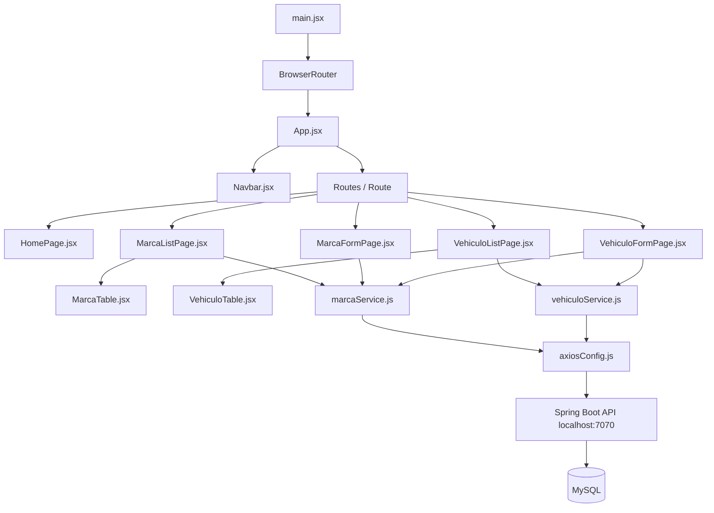

# Automotora Frontend React — Estructura de carpetas y comunicación entre componentes

Este documento resume de forma breve la estructura del proyecto frontend desarrollado con **React + Vite + Bootstrap + Axios + React Router DOM**, conectado al backend **Spring Boot** que corre en `http://localhost:7070`.

El objetivo es entender rápidamente para qué sirve cada carpeta, qué responsabilidad tiene cada archivo y cómo se comunican los componentes principales del frontend.

---

## 1. Estructura general del proyecto

```txt
automotora-frontend/
├── .env
├── package.json
├── vite.config.js
├── index.html
│
└── src/
    ├── assets/
    │   └── styles.css
    │
    ├── components/
    │   ├── Navbar.jsx
    │   ├── MarcaTable.jsx
    │   └── VehiculoTable.jsx
    │
    ├── pages/
    │   ├── HomePage.jsx
    │   ├── MarcaListPage.jsx
    │   ├── MarcaFormPage.jsx
    │   ├── VehiculoListPage.jsx
    │   └── VehiculoFormPage.jsx
    │
    ├── services/
    │   ├── axiosConfig.js
    │   ├── marcaService.js
    │   └── vehiculoService.js
    │
    ├── hooks/
    │
    ├── App.jsx
    └── main.jsx
```

---

## 2. Archivos de raíz del proyecto

### `.env`

Guarda variables de entorno usadas por Vite.

En este proyecto contiene la URL base del backend:

```env
VITE_API_URL=http://localhost:7070
```

React lee esta variable desde `axiosConfig.js` usando:

```js
import.meta.env.VITE_API_URL
```

Esto evita escribir `http://localhost:7070` manualmente en todos los servicios.

---

### `package.json`

Es el equivalente frontend del `pom.xml` en Spring Boot.

Define:

- Nombre del proyecto.
- Scripts de ejecución.
- Dependencias instaladas.
- Versiones de librerías.

Ejemplos de dependencias usadas:

```txt
react
react-dom
vite
axios
bootstrap
react-router-dom
```

Script principal de desarrollo:

```bash
npm run dev
```

---

### `vite.config.js`

Archivo de configuración de Vite.

Vite es la herramienta que crea, ejecuta y compila el proyecto React.

Normalmente no necesitamos modificar mucho este archivo para un proyecto básico.

---

### `index.html`

Es el HTML base donde React monta toda la aplicación.

Contiene un elemento como este:

```html
<div id="root"></div>
```

React toma ese `root` y dentro de él renderiza el componente principal `App.jsx`.

---

## 3. Carpeta `src/`

La carpeta `src/` contiene todo el código fuente principal del frontend.

Aquí están los componentes, páginas, servicios, estilos y punto de entrada de React.

---

## 4. Carpeta `src/assets/`

### Responsabilidad

Guarda recursos estáticos o globales del frontend.

Puede contener:

- Imágenes.
- Íconos.
- Estilos globales.
- Archivos auxiliares visuales.

---

### `src/assets/styles.css`

Archivo reservado para estilos personalizados del proyecto.

Aunque usamos Bootstrap, este archivo puede servir para ajustes propios, por ejemplo:

- Separación entre secciones.
- Ajustes de tablas.
- Estilos de títulos.
- Detalles visuales específicos del sistema.

---

## 5. Carpeta `src/components/`

### Responsabilidad

Contiene componentes reutilizables.

Un componente reutilizable es una pieza visual que puede ser usada dentro de una o varias páginas.

En este proyecto, los componentes no son responsables de llamar directamente al backend. Esa responsabilidad queda en las páginas y servicios.

---

### `src/components/Navbar.jsx`

Componente del menú superior de navegación.

Usa `NavLink` de React Router DOM para navegar sin recargar la página.

Rutas principales:

```txt
/           → Inicio
/marcas     → Gestión de marcas
/vehiculos  → Gestión de vehículos
```

Responsabilidad principal:

```txt
Mostrar el menú y permitir navegar entre páginas.
```

---

### `src/components/MarcaTable.jsx`

Componente visual que muestra una tabla de marcas.

Recibe datos por props desde `MarcaListPage.jsx`.

Props principales:

```jsx
marcas
onEditar
onEliminar
```

Responsabilidades:

- Mostrar la lista de marcas.
- Mostrar `idMarca`.
- Mostrar `nombreMarca`.
- Mostrar botones `Editar` y `Eliminar`.
- Avisar al componente padre cuando el usuario desea editar o eliminar.

No llama directamente a Axios ni al backend.

---

### `src/components/VehiculoTable.jsx`

Componente visual que muestra una tabla de vehículos.

Recibe datos por props desde `VehiculoListPage.jsx`.

Props principales:

```jsx
vehiculos
onEditar
onEliminar
```

Responsabilidades:

- Mostrar `idVehiculo`.
- Mostrar `patente`.
- Mostrar `modelo`.
- Mostrar la marca asociada: `vehiculo.marca.nombreMarca`.
- Mostrar botones `Editar` y `Eliminar`.
- Avisar al componente padre cuando el usuario desea editar o eliminar.

No llama directamente al backend.

---

## 6. Carpeta `src/pages/`

### Responsabilidad

Contiene páginas completas asociadas a rutas de React Router.

Una página normalmente:

- Carga datos.
- Usa estados con `useState`.
- Ejecuta efectos con `useEffect`.
- Llama a servicios.
- Usa componentes reutilizables.
- Maneja navegación con `useNavigate`.
- Lee parámetros de URL con `useParams`.

Analogía con Spring Boot:

```txt
Controller de Spring Boot → Recibe una ruta REST.
Page de React             → Se muestra cuando el navegador entra a una ruta.
```

---

### `src/pages/HomePage.jsx`

Página de inicio del sistema.

Ruta:

```txt
/
```

Responsabilidad:

- Presentar el sistema Automotora.
- Mostrar información general del frontend y backend.
- Servir como pantalla inicial.

---

### `src/pages/MarcaListPage.jsx`

Página principal de gestión de marcas.

Ruta:

```txt
/marcas
```

Responsabilidades:

- Cargar marcas desde el backend con `GET /marca`.
- Guardar marcas en estado.
- Filtrar por ID.
- Filtrar por nombre.
- Limitar longitud de filtros.
- Mostrar contador de caracteres en filtros.
- Usar `MarcaTable.jsx` para mostrar la tabla.
- Eliminar marcas con `DELETE /marca/{idMarca}`.
- Navegar hacia crear marca.
- Navegar hacia editar marca.

Servicios usados:

```js
obtenerTodasLasMarcas()
eliminarMarca(idMarca)
```

---

### `src/pages/MarcaFormPage.jsx`

Página para crear y editar marcas.

Rutas:

```txt
/marcas/agregar
/marcas/editar/:idMarca
```

Responsabilidades:

- Crear marcas con `POST /marca`.
- Editar marcas con `PUT /marca`.
- Cargar una marca específica con `GET /marca/{idMarca}` cuando está en modo edición.
- Usar formulario controlado.
- Validar que `nombreMarca` no esté vacío.
- Limitar `nombreMarca` a 50 caracteres.
- Mostrar contador de caracteres.
- Redirigir a `/marcas` después de guardar.

Servicios usados:

```js
agregarMarca(nuevaMarca)
actualizarMarca(marcaActualizada)
obtenerMarcaPorId(idMarca)
```

---

### `src/pages/VehiculoListPage.jsx`

Página principal de gestión de vehículos.

Ruta:

```txt
/vehiculos
```

Responsabilidades:

- Cargar vehículos desde el backend con `GET /vehiculo`.
- Guardar vehículos en estado.
- Filtrar por ID.
- Filtrar por patente.
- Filtrar por modelo.
- Filtrar por marca.
- Limitar longitud de filtros.
- Mostrar contador de caracteres en filtros.
- Usar `VehiculoTable.jsx` para mostrar la tabla.
- Eliminar vehículos con `DELETE /vehiculo/{idVehiculo}`.
- Navegar hacia crear vehículo.
- Navegar hacia editar vehículo.

Servicios usados:

```js
obtenerTodosLosVehiculos()
eliminarVehiculo(idVehiculo)
```

---

### `src/pages/VehiculoFormPage.jsx`

Página para crear y editar vehículos.

Rutas:

```txt
/vehiculos/agregar
/vehiculos/editar/:idVehiculo
```

Responsabilidades:

- Crear vehículos con `POST /vehiculo`.
- Editar vehículos con `PUT /vehiculo`.
- Cargar un vehículo específico con `GET /vehiculo/{idVehiculo}` cuando está en modo edición.
- Cargar marcas con `GET /marca` para llenar el `<select>`.
- Usar formulario controlado.
- Validar patente, modelo y marca.
- Limitar `patente` a 10 caracteres.
- Limitar `modelo` a 50 caracteres.
- Mostrar contadores de caracteres.
- Convertir `idMarca` e `idVehiculo` a número con `parseInt`.
- Redirigir a `/vehiculos` después de guardar.

Servicios usados:

```js
obtenerTodasLasMarcas()
agregarVehiculo(nuevoVehiculo)
actualizarVehiculo(vehiculoActualizado)
obtenerVehiculoPorId(idVehiculo)
```

---

## 7. Carpeta `src/services/`

### Responsabilidad

Contiene la capa de comunicación HTTP del frontend.

Aquí están las llamadas REST hacia Spring Boot.

Analogía:

```txt
Backend:
MarcaService.java    → lógica de negocio.

Frontend:
marcaService.js      → llamadas HTTP a endpoints de marca.
```

Los servicios frontend no deberían renderizar HTML ni manejar vistas.

---

### `src/services/axiosConfig.js`

Configura una instancia central de Axios.

Responsabilidades:

- Leer `VITE_API_URL` desde `.env`.
- Definir `baseURL`.
- Definir headers JSON.

Ejemplo conceptual:

```js
const api = axios.create({
  baseURL: import.meta.env.VITE_API_URL,
  headers: {
    "Content-Type": "application/json"
  }
});
```

Gracias a este archivo, una llamada como:

```js
api.get("/marca")
```

se convierte en:

```txt
GET http://localhost:7070/marca
```

---

### `src/services/marcaService.js`

Centraliza las llamadas REST de la entidad Marca.

Funciones principales:

```js
obtenerTodasLasMarcas()
obtenerMarcaPorId(idMarca)
agregarMarca(nuevaMarca)
actualizarMarca(marcaActualizada)
eliminarMarca(idMarca)
```

Endpoints relacionados:

```txt
GET     /marca
GET     /marca/{idMarca}
POST    /marca
PUT     /marca
DELETE  /marca/{idMarca}
```

También convierte IDs con `parseInt` cuando corresponde.

---

### `src/services/vehiculoService.js`

Centraliza las llamadas REST de la entidad Vehículo.

Funciones principales:

```js
obtenerTodosLosVehiculos()
obtenerVehiculoPorId(idVehiculo)
agregarVehiculo(nuevoVehiculo)
actualizarVehiculo(vehiculoActualizado)
eliminarVehiculo(idVehiculo)
```

Endpoints relacionados:

```txt
GET     /vehiculo
GET     /vehiculo/{idVehiculo}
POST    /vehiculo
PUT     /vehiculo
DELETE  /vehiculo/{idVehiculo}
```

También convierte IDs con `parseInt` antes de enviar al backend.

---

## 8. Carpeta `src/hooks/`

### Responsabilidad

Carpeta reservada para custom hooks.

Actualmente puede estar vacía.

Un custom hook sirve para extraer lógica reutilizable de React.

Ejemplos futuros:

```txt
useMarcas.js
useVehiculos.js
useMensajes.js
```

No es obligatorio usarla en esta etapa, pero dejarla preparada ayuda a mantener una arquitectura escalable.

---

## 9. Archivos principales de arranque

### `src/main.jsx`

Es el punto de entrada de React.

Responsabilidades:

- Montar `App.jsx` dentro del `div#root`.
- Envolver la aplicación con `BrowserRouter`.
- Importar Bootstrap.
- Importar estilos globales.

Conceptualmente es parecido al `main` de Spring Boot, pero para el frontend.

---

### `src/App.jsx`

Es el componente raíz de la aplicación.

Responsabilidades:

- Mostrar `Navbar`.
- Definir rutas con `Routes` y `Route`.
- Asociar URLs con páginas.

Rutas principales:

```txt
/                              → HomePage
/marcas                        → MarcaListPage
/marcas/agregar                → MarcaFormPage
/marcas/editar/:idMarca        → MarcaFormPage
/vehiculos                     → VehiculoListPage
/vehiculos/agregar             → VehiculoFormPage
/vehiculos/editar/:idVehiculo  → VehiculoFormPage
```

---

## 10. Comunicación general del frontend

El flujo general es:

```txt
main.jsx
  ↓
App.jsx
  ↓
Routes
  ↓
Page correspondiente
  ↓
Componentes reutilizables
  ↓
Servicios Axios
  ↓
Backend Spring Boot
```

Ejemplo con marcas:

```txt
Usuario entra a /marcas
  ↓
App.jsx muestra MarcaListPage
  ↓
MarcaListPage llama obtenerTodasLasMarcas()
  ↓
marcaService.js usa axiosConfig.js
  ↓
Axios llama GET http://localhost:7070/marca
  ↓
Spring Boot responde JSON
  ↓
MarcaListPage guarda datos en useState
  ↓
MarcaTable muestra la tabla
```

Ejemplo con vehículos:

```txt
Usuario entra a /vehiculos/agregar
  ↓
App.jsx muestra VehiculoFormPage
  ↓
VehiculoFormPage carga marcas con obtenerTodasLasMarcas()
  ↓
El usuario completa patente, modelo y marca
  ↓
VehiculoFormPage llama agregarVehiculo()
  ↓
vehiculoService.js envía POST /vehiculo
  ↓
Spring Boot guarda en MySQL
  ↓
React navega a /vehiculos
```

---

## 11. Diagrama Mermaid de comunicación

Este diagrama representa la comunicación principal entre componentes del frontend y servicios REST.



---

## 12. Idea principal de la arquitectura

La arquitectura queda separada así:

```txt
pages/
- Manejan lógica de pantalla.
- Llaman a servicios.
- Usan estado.
- Navegan entre rutas.

components/
- Muestran partes reutilizables.
- Reciben datos por props.
- No llaman directamente al backend.

services/
- Centralizan llamadas REST.
- Usan Axios.
- No muestran interfaz.

App.jsx
- Define rutas.

main.jsx
- Arranca React.
```

Esta separación hace que el proyecto sea más claro, más fácil de mantener y más parecido a una arquitectura por capas como la que ya usas en Spring Boot.

---

# 13. Diccionario de terminología técnica

Este diccionario resume los términos técnicos usados en el proyecto. La idea es explicarlos de forma simple y con ejemplos aplicados a **Automotora**, para que puedas repasar rápidamente qué significa cada concepto.

---

## 13.1. React

**Qué es:**  
React es una librería de JavaScript para construir interfaces visuales mediante componentes.

**Explicación simple:**  
React se encarga de mostrar pantallas, formularios, tablas, botones y navegación en el navegador.

**Ejemplo en Automotora:**  
La pantalla donde ves la lista de marcas está hecha con React:

```txt
/marcas → MarcaListPage.jsx
```

React recibe datos del backend y los transforma en una tabla visual.

---

## 13.2. Frontend

**Qué es:**  
Es la parte visual de una aplicación, la que usa el usuario en el navegador.

**Explicación simple:**  
Es la “cara” del sistema.

**Ejemplo en Automotora:**  
El frontend es el proyecto React donde están:

```txt
Navbar.jsx
MarcaListPage.jsx
VehiculoListPage.jsx
MarcaFormPage.jsx
VehiculoFormPage.jsx
```

---

## 13.3. Backend

**Qué es:**  
Es la parte del sistema que contiene la lógica, procesa datos y se comunica con la base de datos.

**Explicación simple:**  
Es el “motor” del sistema.

**Ejemplo en Automotora:**  
Tu backend está hecho en Spring Boot y tiene:

```txt
MarcaController.java
VehiculoController.java
MarcaService.java
VehiculoService.java
MarcaRepository.java
VehiculoRepository.java
```

---

## 13.4. Spring Boot

**Qué es:**  
Framework de Java usado para crear aplicaciones backend y APIs REST.

**Explicación simple:**  
Permite crear endpoints que React puede consumir.

**Ejemplo en Automotora:**  

```txt
GET http://localhost:7070/marca
```

Ese endpoint viene desde Spring Boot y devuelve las marcas guardadas en MySQL.

---

## 13.5. API REST

**Qué es:**  
Es una forma estándar de comunicar sistemas usando HTTP.

**Explicación simple:**  
React le pide datos al backend mediante URLs.

**Ejemplo en Automotora:**

```txt
GET     /marca
POST    /marca
PUT     /marca
DELETE  /marca/{idMarca}
```

Cada endpoint representa una operación sobre marcas.

---

## 13.6. Endpoint

**Qué es:**  
Es una URL específica del backend que permite realizar una acción.

**Explicación simple:**  
Es una “puerta” del backend.

**Ejemplo en Automotora:**

```txt
GET http://localhost:7070/vehiculo
```

Ese endpoint devuelve todos los vehículos.

---

## 13.7. HTTP

**Qué es:**  
Protocolo que permite la comunicación entre navegador, frontend y backend.

**Explicación simple:**  
Es el lenguaje base que usan React y Spring Boot para comunicarse.

**Ejemplo en Automotora:**  
Cuando React ejecuta:

```js
api.get("/marca")
```

se realiza una petición HTTP al backend.

---

## 13.8. GET

**Qué es:**  
Método HTTP usado para consultar datos.

**Explicación simple:**  
Sirve para pedir información.

**Ejemplo en Automotora:**

```txt
GET /marca
```

Obtiene todas las marcas.

---

## 13.9. POST

**Qué es:**  
Método HTTP usado para crear un nuevo registro.

**Explicación simple:**  
Sirve para guardar algo nuevo.

**Ejemplo en Automotora:**

```txt
POST /vehiculo
```

Crea un vehículo nuevo.

JSON enviado:

```json
{
  "patente": "ABCD12",
  "modelo": "Corolla",
  "idMarca": 1
}
```

---

## 13.10. PUT

**Qué es:**  
Método HTTP usado para actualizar un registro existente.

**Explicación simple:**  
Sirve para modificar algo que ya existe.

**Ejemplo en Automotora:**

```txt
PUT /marca
```

Actualiza una marca.

JSON enviado:

```json
{
  "idMarca": 1,
  "nombreMarca": "Toyota"
}
```

---

## 13.11. DELETE

**Qué es:**  
Método HTTP usado para eliminar un registro.

**Explicación simple:**  
Sirve para borrar datos.

**Ejemplo en Automotora:**

```txt
DELETE /vehiculo/3
```

Elimina el vehículo con ID `3`.

---

## 13.12. JSON

**Qué es:**  
Formato de texto usado para enviar y recibir datos entre frontend y backend.

**Explicación simple:**  
Es una forma ordenada de representar datos.

**Ejemplo en Automotora:**

```json
{
  "idMarca": 1,
  "nombreMarca": "Toyota"
}
```

React recibe este JSON y lo muestra en pantalla.

---

## 13.13. DTO

**Qué es:**  
Objeto usado para transportar datos entre capas o sistemas.

**Explicación simple:**  
Es un molde que indica qué datos debe recibir o enviar el backend.

**Ejemplo en Automotora:**  
`AgregarVehiculo.java` espera:

```java
private String patente;
private String modelo;
private Integer idMarca;
```

Entonces React debe enviar:

```json
{
  "patente": "ABCD12",
  "modelo": "Corolla",
  "idMarca": 1
}
```

---

## 13.14. Entity / Entidad

**Qué es:**  
Clase Java que representa una tabla de la base de datos.

**Explicación simple:**  
Es el modelo principal que Hibernate usa para guardar datos.

**Ejemplo en Automotora:**

```java
@Entity
public class Marca {
    private int idMarca;
    private String nombreMarca;
}
```

Representa la tabla `marca`.

---

## 13.15. Repository

**Qué es:**  
Capa de Spring Boot encargada de acceder a la base de datos.

**Explicación simple:**  
Es quien habla con MySQL.

**Ejemplo en Automotora:**

```java
public interface MarcaRepository extends JpaRepository<Marca, Integer> {
}
```

Permite usar métodos como:

```java
findAll()
findById()
save()
deleteById()
```

---

## 13.16. Service en backend

**Qué es:**  
Capa donde vive la lógica de negocio del backend.

**Explicación simple:**  
Es donde se valida y decide qué hacer antes de guardar o devolver datos.

**Ejemplo en Automotora:**  
`VehiculoService.java` valida que:

```txt
patente no esté vacía
modelo no esté vacío
idMarca sea válido
```

antes de crear un vehículo.

---

## 13.17. Service en frontend

**Qué es:**  
Archivo que centraliza llamadas HTTP desde React al backend.

**Explicación simple:**  
Es el lugar donde React “habla” con Spring Boot.

**Ejemplo en Automotora:**

```js
obtenerTodasLasMarcas()
agregarMarca()
actualizarMarca()
eliminarMarca()
```

Estas funciones viven en:

```txt
src/services/marcaService.js
```

---

## 13.18. Axios

**Qué es:**  
Librería JavaScript para hacer peticiones HTTP.

**Explicación simple:**  
Es la herramienta que usa React para llamar al backend.

**Ejemplo en Automotora:**

```js
const respuesta = await api.get("/marca");
return respuesta.data;
```

Axios llama al endpoint y devuelve los datos.

---

## 13.19. `axiosConfig.js`

**Qué es:**  
Archivo donde configuramos Axios de forma centralizada.

**Explicación simple:**  
Evita repetir la URL del backend muchas veces.

**Ejemplo en Automotora:**

```js
const api = axios.create({
  baseURL: import.meta.env.VITE_API_URL
});
```

Con esto:

```js
api.get("/marca")
```

equivale a:

```txt
GET http://localhost:7070/marca
```

---

## 13.20. `.env`

**Qué es:**  
Archivo para guardar variables de configuración.

**Explicación simple:**  
Permite guardar datos que pueden cambiar según el ambiente.

**Ejemplo en Automotora:**

```env
VITE_API_URL=http://localhost:7070
```

Así React sabe dónde está el backend.

---

## 13.21. Vite

**Qué es:**  
Herramienta para crear y ejecutar proyectos React modernos.

**Explicación simple:**  
Es quien levanta el servidor de desarrollo del frontend.

**Ejemplo en Automotora:**

```bash
npm run dev
```

Levanta React normalmente en:

```txt
http://localhost:5173
```

o:

```txt
http://localhost:5174
```

si el puerto 5173 está ocupado.

---

## 13.22. `npm`

**Qué es:**  
Administrador de paquetes de JavaScript.

**Explicación simple:**  
Sirve para instalar librerías.

**Ejemplo en Automotora:**

```bash
npm install axios
npm install react-router-dom bootstrap
```

---

## 13.23. `package.json`

**Qué es:**  
Archivo que define las dependencias y scripts del proyecto frontend.

**Explicación simple:**  
Es parecido al `pom.xml` de Maven, pero para React.

**Ejemplo en Automotora:**  
Contiene dependencias como:

```json
{
  "dependencies": {
    "axios": "...",
    "bootstrap": "...",
    "react-router-dom": "..."
  }
}
```

---

## 13.24. Componente

**Qué es:**  
Función de React que retorna JSX.

**Explicación simple:**  
Es una pieza visual reutilizable.

**Ejemplo en Automotora:**

```txt
Navbar.jsx
MarcaTable.jsx
VehiculoTable.jsx
```

`MarcaTable.jsx` muestra una tabla de marcas.

---

## 13.25. JSX

**Qué es:**  
Sintaxis que permite escribir estructura visual parecida a HTML dentro de JavaScript.

**Explicación simple:**  
Es “HTML dentro de React”, aunque técnicamente no es HTML puro.

**Ejemplo en Automotora:**

```jsx
<h2>Gestión de Marcas</h2>
```

---

## 13.26. `className`

**Qué es:**  
Atributo usado en JSX para asignar clases CSS.

**Explicación simple:**  
En React no usamos `class`, usamos `className`.

**Ejemplo en Automotora:**

```jsx
<div className="card">
```

En HTML sería:

```html
<div class="card">
```

---

## 13.27. `htmlFor`

**Qué es:**  
Atributo usado en JSX para asociar un label con un input.

**Explicación simple:**  
En React no usamos `for`, usamos `htmlFor`.

**Ejemplo en Automotora:**

```jsx
<label htmlFor="nombreMarca">Nombre de la marca</label>
<input id="nombreMarca" />
```

---

## 13.28. Props

**Qué es:**  
Datos o funciones que un componente padre pasa a un componente hijo.

**Explicación simple:**  
Son como parámetros.

**Ejemplo en Automotora:**

```jsx
<MarcaTable
  marcas={marcasFiltradas}
  onEditar={manejarEditarMarca}
  onEliminar={manejarEliminarMarca}
/>
```

`MarcaListPage.jsx` le pasa datos y funciones a `MarcaTable.jsx`.

---

## 13.29. Estado / `useState`

**Qué es:**  
Hook de React para guardar datos que pueden cambiar.

**Explicación simple:**  
Es una variable especial que actualiza la pantalla cuando cambia.

**Ejemplo en Automotora:**

```js
const [marcas, setMarcas] = useState([]);
```

Cuando llamamos:

```js
setMarcas(datos);
```

React vuelve a renderizar la tabla.

---

## 13.30. Hook

**Qué es:**  
Función especial de React que permite usar características como estado, efectos o navegación.

**Explicación simple:**  
Es una herramienta interna de React.

**Ejemplos en Automotora:**

```js
useState()
useEffect()
useNavigate()
useParams()
```

---

## 13.31. `useEffect`

**Qué es:**  
Hook que permite ejecutar código cuando un componente se monta o cuando cambia una dependencia.

**Explicación simple:**  
Sirve para cargar datos al abrir una página.

**Ejemplo en Automotora:**

```js
useEffect(() => {
  cargarMarcas();
}, []);
```

Esto carga marcas cuando el usuario entra a `/marcas`.

---

## 13.32. Array de dependencias

**Qué es:**  
Segundo parámetro de `useEffect`.

**Explicación simple:**  
Indica cuándo debe ejecutarse el efecto.

**Ejemplo en Automotora:**

```js
useEffect(() => {
  cargarDatosIniciales();
}, [modoEdicion, idVehiculo]);
```

Se ejecuta cuando cambia `modoEdicion` o `idVehiculo`.

---

## 13.33. Renderizar

**Qué es:**  
Proceso por el cual React muestra algo en pantalla.

**Explicación simple:**  
Es cuando React “pinta” la interfaz.

**Ejemplo en Automotora:**  
Cuando `setVehiculos(datos)` actualiza el estado, React vuelve a renderizar la tabla de vehículos.

---

## 13.34. React Router DOM

**Qué es:**  
Librería para manejar rutas en React.

**Explicación simple:**  
Permite tener varias páginas dentro del frontend.

**Ejemplo en Automotora:**

```txt
/marcas
/vehiculos
/marcas/agregar
/vehiculos/editar/3
```

---

## 13.35. `BrowserRouter`

**Qué es:**  
Componente que habilita el sistema de rutas.

**Explicación simple:**  
Envuelve la aplicación para que React Router funcione.

**Ejemplo en Automotora:**

```jsx
<BrowserRouter>
  <App />
</BrowserRouter>
```

---

## 13.36. `Routes`

**Qué es:**  
Contenedor donde se declaran las rutas.

**Explicación simple:**  
Agrupa todas las rutas de la aplicación.

**Ejemplo en Automotora:**

```jsx
<Routes>
  <Route path="/marcas" element={<MarcaListPage />} />
</Routes>
```

---

## 13.37. `Route`

**Qué es:**  
Define qué componente se muestra para una URL.

**Explicación simple:**  
Conecta una ruta con una página.

**Ejemplo en Automotora:**

```jsx
<Route path="/vehiculos" element={<VehiculoListPage />} />
```

Cuando entras a `/vehiculos`, React muestra `VehiculoListPage`.

---

## 13.38. `NavLink`

**Qué es:**  
Componente para navegar entre rutas y detectar la ruta activa.

**Explicación simple:**  
Es como un link inteligente.

**Ejemplo en Automotora:**

```jsx
<NavLink to="/marcas">Marcas</NavLink>
```

---

## 13.39. `useNavigate`

**Qué es:**  
Hook para navegar desde código JavaScript.

**Explicación simple:**  
Permite redirigir al usuario después de una acción.

**Ejemplo en Automotora:**

```js
navigate("/marcas");
```

Después de guardar una marca, volvemos al listado.

---

## 13.40. `useParams`

**Qué es:**  
Hook para leer parámetros dinámicos desde la URL.

**Explicación simple:**  
Permite obtener IDs desde rutas como `/editar/3`.

**Ejemplo en Automotora:**

```js
const { idMarca } = useParams();
```

Si la URL es:

```txt
/marcas/editar/3
```

entonces:

```txt
idMarca = "3"
```

---

## 13.41. Formulario controlado

**Qué es:**  
Formulario donde los inputs están conectados al estado de React.

**Explicación simple:**  
React controla lo que el usuario escribe.

**Ejemplo en Automotora:**

```jsx
<input
  value={nombreMarca}
  onChange={(evento) => setNombreMarca(evento.target.value)}
/>
```

---

## 13.42. `value`

**Qué es:**  
Valor que se muestra dentro de un input.

**Explicación simple:**  
El input muestra lo que está guardado en el estado.

**Ejemplo en Automotora:**

```jsx
value={vehiculo.modelo}
```

---

## 13.43. `onChange`

**Qué es:**  
Evento que se ejecuta cuando cambia un input.

**Explicación simple:**  
Sirve para actualizar el estado mientras el usuario escribe.

**Ejemplo en Automotora:**

```jsx
onChange={manejarCambioFormulario}
```

---

## 13.44. `onSubmit`

**Qué es:**  
Evento que se ejecuta cuando se envía un formulario.

**Explicación simple:**  
Sirve para guardar los datos.

**Ejemplo en Automotora:**

```jsx
<form onSubmit={manejarEnvioFormulario}>
```

---

## 13.45. `preventDefault()`

**Qué es:**  
Método que evita el comportamiento normal del formulario HTML.

**Explicación simple:**  
Evita que la página se recargue al enviar.

**Ejemplo en Automotora:**

```js
evento.preventDefault();
```

---

## 13.46. `map()`

**Qué es:**  
Método de arrays para transformar una lista en otra.

**Explicación simple:**  
En React se usa para convertir datos en elementos visuales.

**Ejemplo en Automotora:**

```jsx
marcas.map((marca) => (
  <tr key={marca.idMarca}>
    <td>{marca.nombreMarca}</td>
  </tr>
))
```

Convierte marcas en filas de tabla.

---

## 13.47. `filter()`

**Qué es:**  
Método de arrays para obtener solo los elementos que cumplen una condición.

**Explicación simple:**  
Sirve para filtrar resultados.

**Ejemplo en Automotora:**

```js
marcas.filter((marca) =>
  marca.nombreMarca.toLowerCase().includes(textoFiltroNombre)
)
```

---

## 13.48. `includes()`

**Qué es:**  
Método que verifica si un texto contiene otro texto.

**Explicación simple:**  
Sirve para búsquedas parciales.

**Ejemplo en Automotora:**

```js
"Toyota".toLowerCase().includes("toy")
```

Devuelve `true`.

---

## 13.49. `trim()`

**Qué es:**  
Método que elimina espacios al inicio y al final de un texto.

**Explicación simple:**  
Limpia lo que escribió el usuario.

**Ejemplo en Automotora:**

```js
nombreMarca.trim()
```

Si el usuario escribe `" Toyota "`, queda `"Toyota"`.

---

## 13.50. `toLowerCase()`

**Qué es:**  
Método que convierte texto a minúsculas.

**Explicación simple:**  
Ayuda a hacer filtros sin importar mayúsculas o minúsculas.

**Ejemplo en Automotora:**

```js
"Toyota".toLowerCase()
```

Resultado:

```txt
toyota
```

---

## 13.51. `parseInt()`

**Qué es:**  
Función que convierte texto a número entero.

**Explicación simple:**  
Es necesaria porque los inputs y parámetros de URL suelen llegar como string.

**Ejemplo en Automotora:**

```js
parseInt(idMarca)
```

Convierte:

```txt
"3"
```

en:

```txt
3
```

---

## 13.52. `Number.isNaN()`

**Qué es:**  
Función que verifica si un valor no es un número válido.

**Explicación simple:**  
Sirve para validar IDs antes de enviarlos al backend.

**Ejemplo en Automotora:**

```js
Number.isNaN(parseInt(idMarca))
```

---

## 13.53. Optional chaining `?.`

**Qué es:**  
Operador que permite acceder a propiedades sin romper la aplicación si algo viene `null` o `undefined`.

**Explicación simple:**  
Pregunta “si existe, accede; si no existe, no falles”.

**Ejemplo en Automotora:**

```jsx
vehiculo.marca?.nombreMarca
```

Si `marca` existe, muestra el nombre.  
Si `marca` no existe, no rompe React.

---

## 13.54. Spread operator `...`

**Qué es:**  
Operador para copiar propiedades de un objeto o elementos de un array.

**Explicación simple:**  
Permite actualizar una parte del estado sin perder el resto.

**Ejemplo en Automotora:**

```js
setVehiculo({
  ...vehiculo,
  modelo: "Corolla"
});
```

Mantiene `patente` e `idMarca`, pero cambia `modelo`.

---

## 13.55. `async/await`

**Qué es:**  
Sintaxis para trabajar con operaciones asíncronas.

**Explicación simple:**  
Permite esperar una respuesta del backend antes de continuar.

**Ejemplo en Automotora:**

```js
const datos = await obtenerTodasLasMarcas();
```

React espera a que el backend responda.

---

## 13.56. `try/catch/finally`

**Qué es:**  
Estructura para manejar errores.

**Explicación simple:**  
Permite intentar una operación, capturar errores y ejecutar limpieza final.

**Ejemplo en Automotora:**

```js
try {
  const datos = await obtenerTodasLasMarcas();
} catch (error) {
  setError("No se pudieron cargar las marcas.");
} finally {
  setCargando(false);
}
```

---

## 13.57. `response.data`

**Qué es:**  
Parte de la respuesta Axios donde vienen los datos reales del backend.

**Explicación simple:**  
Axios devuelve un objeto grande, pero el JSON útil está en `data`.

**Ejemplo en Automotora:**

```js
const respuesta = await api.get("/marca");
return respuesta.data;
```

---

## 13.58. CORS

**Qué es:**  
Mecanismo de seguridad del navegador que controla qué frontend puede llamar a qué backend.

**Explicación simple:**  
Spring Boot debe permitir que React lo llame desde otro puerto.

**Ejemplo en Automotora:**  
Backend:

```txt
http://localhost:7070
```

Frontend:

```txt
http://localhost:5173
```

Como son puertos distintos, hay que permitir CORS.

---

## 13.59. Puerto

**Qué es:**  
Número que identifica un servicio corriendo en una máquina.

**Explicación simple:**  
Es como una “puerta” de red.

**Ejemplo en Automotora:**

```txt
Backend Spring Boot → puerto 7070
Frontend React     → puerto 5173 o 5174
```

---

## 13.60. Bootstrap

**Qué es:**  
Framework CSS para crear interfaces visuales rápidamente.

**Explicación simple:**  
Nos da clases listas para botones, tablas, formularios, tarjetas y navegación.

**Ejemplo en Automotora:**

```jsx
<button className="btn btn-primary">
  Guardar
</button>
```

---

## 13.61. `card`

**Qué es:**  
Clase Bootstrap para mostrar contenido dentro de una tarjeta visual.

**Explicación simple:**  
Sirve para agrupar contenido con borde y separación.

**Ejemplo en Automotora:**

```jsx
<div className="card">
  <div className="card-body">
    ...
  </div>
</div>
```

---

## 13.62. `table`

**Qué es:**  
Clase Bootstrap para dar estilo a tablas.

**Explicación simple:**  
Hace que las tablas se vean ordenadas.

**Ejemplo en Automotora:**

```jsx
<table className="table table-striped table-bordered">
```

---

## 13.63. `alert`

**Qué es:**  
Clase Bootstrap para mostrar mensajes visuales.

**Explicación simple:**  
Sirve para mostrar errores, advertencias o éxitos.

**Ejemplo en Automotora:**

```jsx
<div className="alert alert-danger">
  No se pudo guardar el vehículo.
</div>
```

---

## 13.64. `maxLength`

**Qué es:**  
Atributo que limita cuántos caracteres puede escribir el usuario.

**Explicación simple:**  
Evita que el input acepte más texto del permitido.

**Ejemplo en Automotora:**

```jsx
<input maxLength={50} />
```

---

## 13.65. `inputMode="numeric"`

**Qué es:**  
Atributo que sugiere al navegador mostrar teclado numérico en dispositivos móviles.

**Explicación simple:**  
Ayuda a que un filtro de ID se use como número.

**Ejemplo en Automotora:**

```jsx
<input type="text" inputMode="numeric" />
```

---

## 13.66. `replace(/\D/g, "")`

**Qué es:**  
Expresión que elimina todo lo que no sea número.

**Explicación simple:**  
Sirve para limpiar filtros de ID.

**Ejemplo en Automotora:**

```js
const soloNumeros = valor.replace(/\D/g, "");
```

Si el usuario escribe:

```txt
abc123
```

queda:

```txt
123
```

---

## 13.67. `key`

**Qué es:**  
Propiedad especial que React usa al renderizar listas.

**Explicación simple:**  
Ayuda a React a identificar cada elemento de una lista.

**Ejemplo en Automotora:**

```jsx
<tr key={marca.idMarca}>
```

Cada fila tiene una clave única.

---

## 13.68. `window.confirm()`

**Qué es:**  
Función del navegador que muestra un cuadro de confirmación.

**Explicación simple:**  
Sirve para preguntar antes de eliminar.

**Ejemplo en Automotora:**

```js
const confirmar = window.confirm("¿Deseas eliminar?");
```

---

## 13.69. Navegación programática

**Qué es:**  
Cambiar de ruta usando código en vez de hacer clic en un link.

**Explicación simple:**  
React manda al usuario a otra pantalla después de una acción.

**Ejemplo en Automotora:**

```js
navigate("/vehiculos");
```

Después de guardar un vehículo, React vuelve al listado.

---

## 13.70. Props de función

**Qué es:**  
Funciones que un componente padre pasa a un hijo.

**Explicación simple:**  
El hijo avisa al padre que ocurrió algo.

**Ejemplo en Automotora:**

```jsx
<MarcaTable onEliminar={manejarEliminarMarca} />
```

`MarcaTable` no elimina directamente.  
Solo llama a `onEliminar(idMarca)` y el padre decide qué hacer.

---

## 13.71. Componente padre

**Qué es:**  
Componente que usa a otro componente dentro de su JSX.

**Explicación simple:**  
Es quien pasa datos y funciones.

**Ejemplo en Automotora:**

```txt
MarcaListPage.jsx
```

es padre de:

```txt
MarcaTable.jsx
```

---

## 13.72. Componente hijo

**Qué es:**  
Componente usado dentro de otro.

**Explicación simple:**  
Recibe props desde el padre.

**Ejemplo en Automotora:**

```txt
MarcaTable.jsx
```

recibe marcas desde:

```txt
MarcaListPage.jsx
```

---

## 13.73. Página

**Qué es:**  
Componente React asociado a una ruta completa.

**Explicación simple:**  
Es una pantalla del sistema.

**Ejemplo en Automotora:**

```txt
MarcaListPage.jsx → /marcas
VehiculoFormPage.jsx → /vehiculos/agregar
```

---

## 13.74. Ruta dinámica

**Qué es:**  
Ruta que contiene un parámetro variable.

**Explicación simple:**  
Permite usar la misma página para distintos IDs.

**Ejemplo en Automotora:**

```txt
/marcas/editar/:idMarca
```

Si visitas:

```txt
/marcas/editar/5
```

React lee `5` como `idMarca`.

---

## 13.75. CRUD

**Qué es:**  
Sigla de Create, Read, Update, Delete.

**Explicación simple:**  
Representa las operaciones básicas de una aplicación.

**Ejemplo en Automotora:**

```txt
Crear marca
Listar marcas
Editar marca
Eliminar marca
```

---

## 13.76. MySQL

**Qué es:**  
Sistema de base de datos relacional.

**Explicación simple:**  
Lugar donde se guardan las marcas y vehículos.

**Ejemplo en Automotora:**  
Spring Boot guarda datos en la base `full_Stack`.

---

## 13.77. Relación ManyToOne

**Qué es:**  
Relación donde muchos registros pertenecen a uno.

**Explicación simple:**  
Muchos vehículos pueden pertenecer a una marca.

**Ejemplo en Automotora:**

```txt
Vehiculo ManyToOne Marca
```

Un vehículo tiene una marca, pero una marca puede tener varios vehículos.

---

## 13.78. Select

**Qué es:**  
Input HTML para elegir una opción de una lista.

**Explicación simple:**  
Sirve para seleccionar la marca de un vehículo.

**Ejemplo en Automotora:**

```jsx
<select name="idMarca">
  <option value="1">Toyota</option>
</select>
```

El usuario ve `Toyota`, pero React guarda `1`.

---

## 13.79. Contador de caracteres

**Qué es:**  
Texto visual que muestra cuántos caracteres escribió el usuario.

**Explicación simple:**  
Ayuda a saber cuánto falta para llegar al límite.

**Ejemplo en Automotora:**

```jsx
{nombreMarca.length}/50 caracteres
```

---

## 13.80. Validación frontend

**Qué es:**  
Revisión de datos antes de enviarlos al backend.

**Explicación simple:**  
Evita enviar datos claramente incorrectos.

**Ejemplo en Automotora:**

```js
if (nombreMarca.trim() === "") {
  setError("El nombre de la marca es obligatorio.");
}
```

---

## 13.81. Validación backend

**Qué es:**  
Revisión de datos en Spring Boot.

**Explicación simple:**  
Es la segunda barrera de seguridad.

**Ejemplo en Automotora:**

```java
@NotBlank
private String nombreMarca;
```

Aunque React valide, el backend también debe protegerse.

---

## 13.82. `@NotBlank`

**Qué es:**  
Validación de Jakarta Bean Validation.

**Explicación simple:**  
No permite textos vacíos o solo espacios.

**Ejemplo en Automotora:**

```java
@NotBlank
private String patente;
```

---

## 13.83. `@NotNull`

**Qué es:**  
Validación que exige que un valor no sea `null`.

**Explicación simple:**  
Sirve para IDs obligatorios.

**Ejemplo en Automotora:**

```java
@NotNull
private Integer idMarca;
```

---

## 13.84. `@Positive`

**Qué es:**  
Validación que exige números mayores que cero.

**Explicación simple:**  
Sirve para evitar IDs negativos o cero.

**Ejemplo en Automotora:**

```java
@Positive
private Integer idVehiculo;
```

---

## 13.85. `@Size`

**Qué es:**  
Validación que limita el tamaño de un texto o colección.

**Explicación simple:**  
Sirve para reforzar en backend los límites del frontend.

**Ejemplo recomendado en Automotora:**

```java
@Size(max = 50)
private String nombreMarca;
```

---

## 13.86. `localhost`

**Qué es:**  
Dirección que apunta a tu propia computadora.

**Explicación simple:**  
Significa “mi máquina local”.

**Ejemplo en Automotora:**

```txt
http://localhost:7070
```

Es el backend corriendo en tu PC.

---

## 13.87. `src/`

**Qué es:**  
Carpeta principal del código fuente React.

**Explicación simple:**  
Ahí vive la aplicación.

**Ejemplo en Automotora:**

```txt
src/components
src/pages
src/services
```

---

## 13.88. `components/`

**Qué es:**  
Carpeta de piezas reutilizables de interfaz.

**Explicación simple:**  
Guarda partes visuales que pueden usarse en páginas.

**Ejemplo en Automotora:**

```txt
Navbar.jsx
MarcaTable.jsx
VehiculoTable.jsx
```

---

## 13.89. `pages/`

**Qué es:**  
Carpeta de pantallas completas.

**Explicación simple:**  
Cada archivo suele corresponder a una ruta.

**Ejemplo en Automotora:**

```txt
MarcaListPage.jsx → /marcas
```

---

## 13.90. `services/`

**Qué es:**  
Carpeta de comunicación con el backend.

**Explicación simple:**  
Guarda las funciones que llaman endpoints REST.

**Ejemplo en Automotora:**

```txt
marcaService.js
vehiculoService.js
```

---

## 13.91. `assets/`

**Qué es:**  
Carpeta de recursos estáticos.

**Explicación simple:**  
Sirve para estilos, imágenes o íconos.

**Ejemplo en Automotora:**

```txt
styles.css
```

---

## 13.92. `hooks/`

**Qué es:**  
Carpeta reservada para hooks personalizados.

**Explicación simple:**  
Sirve para reutilizar lógica React en el futuro.

**Ejemplo futuro en Automotora:**

```txt
useMarcas.js
useVehiculos.js
```

---

## 13.93. Separación de responsabilidades

**Qué es:**  
Principio de arquitectura donde cada archivo tiene un rol claro.

**Explicación simple:**  
Cada cosa hace una tarea y no mezcla responsabilidades.

**Ejemplo en Automotora:**

```txt
MarcaListPage.jsx → lógica de pantalla
MarcaTable.jsx    → tabla visual
marcaService.js   → llamadas HTTP
```

---

## 13.94. Flujo React → Spring Boot → MySQL

**Qué es:**  
Camino completo de una operación.

**Explicación simple:**  
El usuario hace algo en React, React llama a Spring Boot y Spring Boot guarda o consulta MySQL.

**Ejemplo en Automotora:**

```txt
Usuario crea vehículo
  ↓
VehiculoFormPage.jsx
  ↓
vehiculoService.js
  ↓
POST /vehiculo
  ↓
VehiculoController.java
  ↓
VehiculoService.java
  ↓
VehiculoRepository.java
  ↓
MySQL
```

---

## 13.95. SPA

**Qué es:**  
Single Page Application.

**Explicación simple:**  
Aplicación que carga una sola vez y cambia de pantalla sin recargar todo el navegador.

**Ejemplo en Automotora:**  
Aunque tienes varias páginas visuales:

```txt
/marcas
/vehiculos
/marcas/agregar
```

React las muestra dentro de una misma aplicación.

---

## 13.96. Recargar página vs navegar con React

**Qué es:**  
Diferencia entre navegación tradicional y navegación interna de React.

**Explicación simple:**  
Con React Router se cambia de pantalla sin pedir todo el HTML de nuevo al servidor.

**Ejemplo en Automotora:**

```jsx
<NavLink to="/vehiculos">Vehículos</NavLink>
```

Cambia a la página de vehículos sin recargar toda la aplicación.

---

## 13.97. Estado de carga

**Qué es:**  
Variable que indica si una operación todavía está esperando respuesta.

**Explicación simple:**  
Sirve para mostrar mensajes como “Cargando...”.

**Ejemplo en Automotora:**

```js
const [cargando, setCargando] = useState(true);
```

---

## 13.98. Estado de error

**Qué es:**  
Variable donde guardamos mensajes de error.

**Explicación simple:**  
Sirve para mostrar al usuario qué salió mal.

**Ejemplo en Automotora:**

```js
const [error, setError] = useState("");
```

---

## 13.99. Estado de éxito

**Qué es:**  
Variable donde guardamos mensajes positivos.

**Explicación simple:**  
Sirve para avisar que una acción se completó.

**Ejemplo en Automotora:**

```js
const [mensaje, setMensaje] = useState("");
```

---

## 13.100. `disabled`

**Qué es:**  
Atributo que desactiva un input o botón.

**Explicación simple:**  
Evita que el usuario interactúe mientras se guarda o carga algo.

**Ejemplo en Automotora:**

```jsx
<button disabled={guardando}>
  Guardar
</button>
```

---

## 13.101. `form-text`

**Qué es:**  
Clase Bootstrap para mostrar texto auxiliar debajo de un input.

**Explicación simple:**  
La usamos para los contadores de caracteres.

**Ejemplo en Automotora:**

```jsx
<div className="form-text">
  {modelo.length}/50 caracteres
</div>
```

---

## 13.102. `table-responsive`

**Qué es:**  
Clase Bootstrap que hace que una tabla se adapte mejor a pantallas pequeñas.

**Explicación simple:**  
Evita que la tabla rompa el diseño en pantallas angostas.

**Ejemplo en Automotora:**

```jsx
<div className="table-responsive">
  <table className="table">
```

---

## 13.103. `align-middle`

**Qué es:**  
Clase Bootstrap que alinea verticalmente el contenido de celdas de tabla.

**Explicación simple:**  
Hace que textos y botones queden centrados en altura.

**Ejemplo en Automotora:**

```jsx
<table className="table align-middle">
```

---

## 13.104. `fw-bold`

**Qué es:**  
Clase Bootstrap que aplica negrita.

**Explicación simple:**  
La usamos para destacar la ruta activa del menú.

**Ejemplo en Automotora:**

```js
return isActive ? "nav-link active fw-bold" : "nav-link";
```

---

## 13.105. `gap-2`

**Qué es:**  
Clase Bootstrap que agrega separación entre elementos flexibles.

**Explicación simple:**  
Sirve para separar botones.

**Ejemplo en Automotora:**

```jsx
<div className="d-flex gap-2">
```

---

## 13.106. `row` y `col-md-*`

**Qué es:**  
Clases Bootstrap para crear grillas responsivas.

**Explicación simple:**  
Permiten distribuir filtros en columnas.

**Ejemplo en Automotora:**

```jsx
<div className="row">
  <div className="col-md-3">
```

---

## 13.107. Modo creación

**Qué es:**  
Estado de una página de formulario cuando no hay ID en la URL.

**Explicación simple:**  
Significa que vamos a crear un registro nuevo.

**Ejemplo en Automotora:**

```txt
/marcas/agregar
```

---

## 13.108. Modo edición

**Qué es:**  
Estado de una página de formulario cuando sí hay ID en la URL.

**Explicación simple:**  
Significa que vamos a modificar un registro existente.

**Ejemplo en Automotora:**

```txt
/vehiculos/editar/7
```

---

## 13.109. `Boolean(idMarca)`

**Qué es:**  
Forma de convertir la existencia de un valor en `true` o `false`.

**Explicación simple:**  
Sirve para saber si estamos creando o editando.

**Ejemplo en Automotora:**

```js
const modoEdicion = Boolean(idMarca);
```

Si `idMarca` existe, `modoEdicion` es `true`.

---

## 13.110. Variable derivada

**Qué es:**  
Valor calculado a partir de un estado.

**Explicación simple:**  
No se guarda necesariamente en otro estado, se calcula cuando React renderiza.

**Ejemplo en Automotora:**

```js
const marcasFiltradas = marcas.filter(...);
```

`marcasFiltradas` se calcula a partir de `marcas` y filtros.

---

## 13.111. `Array.isArray()`

**Qué es:**  
Función que verifica si un valor es una lista.

**Explicación simple:**  
Evita usar `.map()` o `.filter()` sobre algo que no sea array.

**Ejemplo en Automotora:**

```js
if (Array.isArray(datos)) {
  setMarcas(datos);
}
```

---

## 13.112. `return`

**Qué es:**  
Palabra clave que devuelve un valor desde una función.

**Explicación simple:**  
En componentes React, devuelve lo que se verá en pantalla.

**Ejemplo en Automotora:**

```jsx
return (
  <div className="card">
    ...
  </div>
);
```

---

## 13.113. Fragment `<>...</>`

**Qué es:**  
Elemento especial de React para agrupar varios elementos sin crear un `div` extra.

**Explicación simple:**  
Sirve cuando un componente necesita devolver más de un elemento.

**Ejemplo en Automotora:**

```jsx
return (
  <>
    <Navbar />
    <main>...</main>
  </>
);
```

---

## 13.114. Import

**Qué es:**  
Forma de traer código desde otro archivo.

**Explicación simple:**  
Permite usar componentes o funciones externas.

**Ejemplo en Automotora:**

```js
import MarcaTable from "../components/MarcaTable";
```

---

## 13.115. Export default

**Qué es:**  
Forma de permitir que otro archivo importe un componente o función.

**Explicación simple:**  
Hace que el archivo pueda ser usado desde otro lugar.

**Ejemplo en Automotora:**

```js
export default MarcaListPage;
```

---

## 13.116. Named export

**Qué es:**  
Forma de exportar varias funciones desde un mismo archivo.

**Explicación simple:**  
Permite importar funciones específicas por nombre.

**Ejemplo en Automotora:**

```js
export const obtenerTodasLasMarcas = async () => { ... };
```

Luego se importa así:

```js
import { obtenerTodasLasMarcas } from "../services/marcaService";
```

---

## 13.117. Local development

**Qué es:**  
Trabajo en ambiente local, usando tu propia computadora.

**Explicación simple:**  
Frontend, backend y base de datos corren en tu máquina.

**Ejemplo en Automotora:**

```txt
React       → localhost:5173
Spring Boot → localhost:7070
MySQL       → localhost:3306
```

---

## 13.118. Swagger

**Qué es:**  
Interfaz para probar endpoints del backend.

**Explicación simple:**  
Permite verificar que Spring Boot funcione antes de conectar React.

**Ejemplo en Automotora:**

```txt
http://localhost:7070/automotora.html
```

---

## 13.119. Integridad de datos

**Qué es:**  
Reglas que protegen la consistencia de la base de datos.

**Explicación simple:**  
Evitan borrar o guardar datos que dejarían relaciones rotas.

**Ejemplo en Automotora:**  
Si una marca tiene vehículos asociados, puede no ser correcto eliminarla sin antes manejar esos vehículos.

---

## 13.120. Arquitectura por capas

**Qué es:**  
Organización del proyecto separando responsabilidades.

**Explicación simple:**  
Cada capa se encarga de una parte del trabajo.

**Ejemplo en Automotora:**

Backend:

```txt
Controller → Service → Repository → MySQL
```

Frontend:

```txt
Page → Component → Service → Axios → Backend
```

---

## 14. Resumen final del diccionario

Los conceptos más importantes para recordar son:

```txt
Componente:
Pieza visual reutilizable.

Página:
Pantalla completa conectada a una ruta.

Servicio frontend:
Archivo que llama al backend.

Axios:
Herramienta para hacer peticiones HTTP.

useState:
Guarda datos que cambian.

useEffect:
Ejecuta código al cargar una página.

React Router:
Permite navegar entre páginas.

Props:
Datos o funciones que un padre entrega a un hijo.

Formulario controlado:
Formulario cuyo valor vive en el estado de React.

parseInt:
Convierte IDs de texto a número.

CORS:
Permite que React y Spring Boot se comuniquen desde puertos distintos.
```

Este diccionario debe servir como referencia rápida para entender la terminología del proyecto y poder continuar desarrollando nuevas funcionalidades con más claridad.
